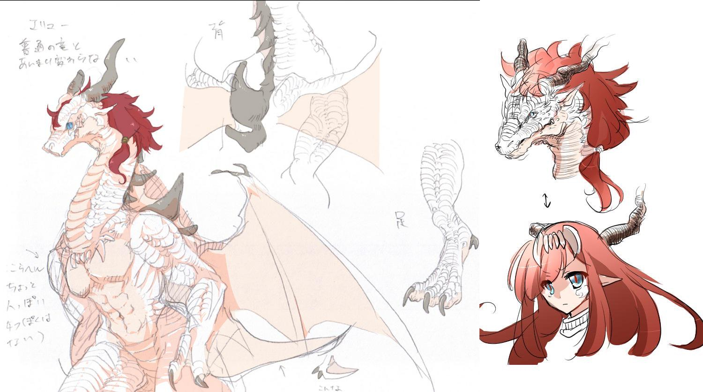

<!-- Main -->

<!-- One -->
<section id="one">
	

		

			

				<header class="major">
					<h2>{{ page.character-name }}</h2>
					
{{ page.prof1 }}

				</header>
				
{{ page.prof2 }}

			

			

				
				

				<h3 class="serifu fade-in-bottom">{{ page.serifu }}</h3>

				<button type="button" class="image-change-botton toggle button">2D⇔3D</button>

			

		

	

</section>

<!-- Two -->
<section id="two">
	

		
Designed by my Friend, 天野きみ. Thanks!

		

			
			
		

	

</section>

<!-- Three -->
<section id="three">
	

		<header class="major">
			<h2>CHARACTER</h2>
		</header>

		

	

</section>

